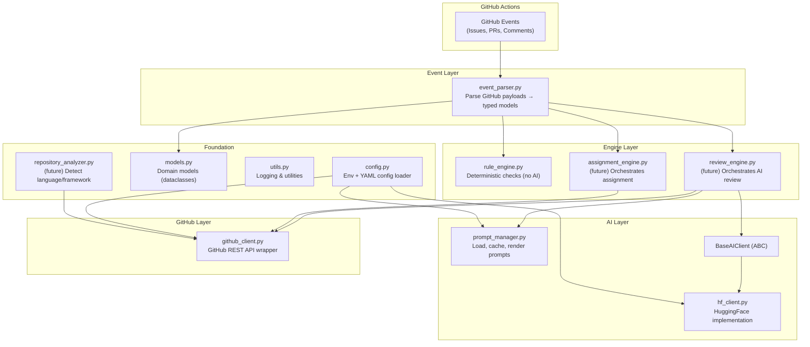
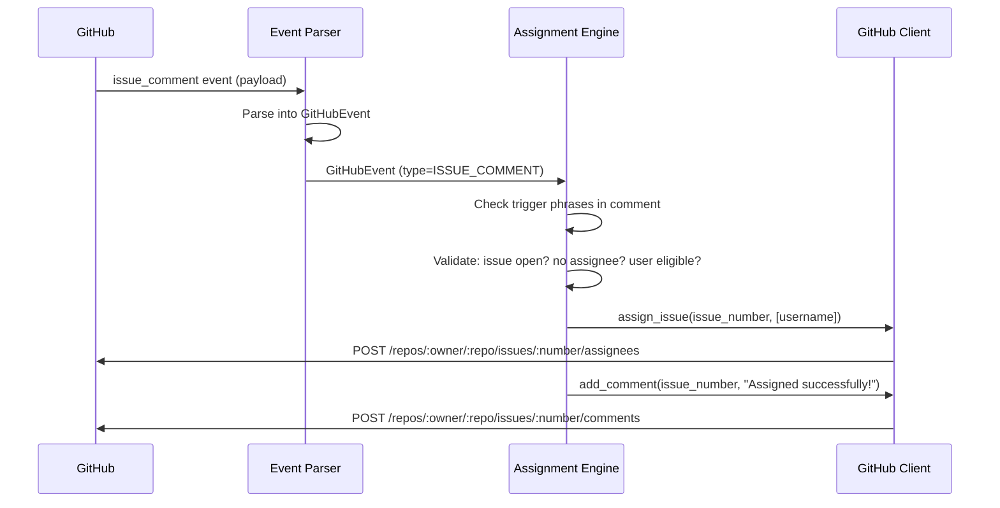
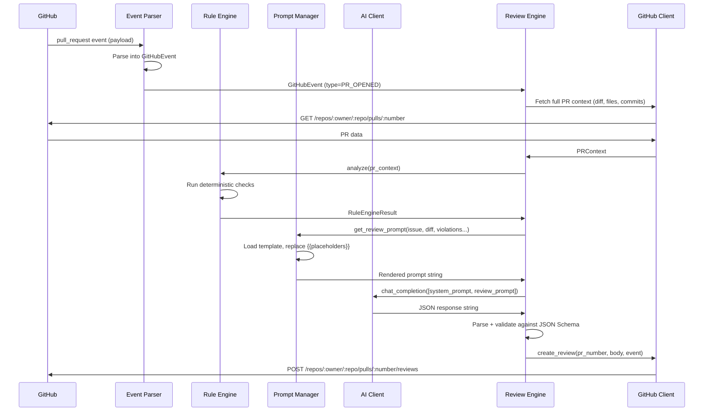
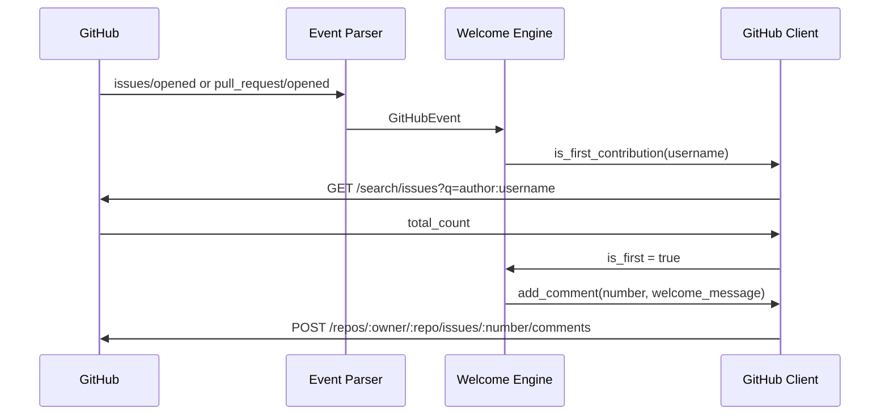

<div align="center">

# 🤖 AI Maintainer — Developer Documentation

### SmartCityApp Automated Repository Maintenance

</div>

---

## 📌 Overview

The **AI Maintainer** is an AI-powered system that automates repository maintenance for SmartCityApp. It behaves like a human maintainer — assigning issues, welcoming contributors, reviewing pull requests, and enforcing code quality standards.

**Goals:**
- Reduce maintainer toil for repetitive tasks
- Provide fast, consistent feedback to contributors
- Enforce coding standards automatically
- Keep AI usage efficient by running deterministic checks first

**Technology Stack:**
- **Language:** Python 3.12+
- **Automation:** GitHub Actions
- **AI Provider:** Hugging Face Inference API (pluggable)
- **Supported Models:** DeepSeek, Qwen, Gemma, Llama

---

## 🏗️ Architecture

### Layered Architecture

The system follows **Clean Architecture** with clear layer separation. Dependencies point inward — outer layers depend on inner layers, never the reverse.



### Key Design Principle: AI Never Talks to GitHub

The AI layer receives prompt strings and returns response strings. It has **zero knowledge** of GitHub APIs, issue numbers, or PR metadata. Engines orchestrate between the two worlds:

```
GitHub Event → Event Parser → Engine → AI Client → Engine → GitHub Client
                                 ↑                      ↓
                             Prompt Manager        Review Result
```

### Design Principles

| Principle | How Applied |
|---|---|
| **Clean Architecture** | Domain models (`models.py`) have zero dependencies. Outer layers depend inward. |
| **Repository Pattern** | `github_client.py` encapsulates all GitHub API knowledge. |
| **Service Layer** | Engines compose clients + models. They never touch APIs directly. |
| **Dependency Injection** | All modules accept config/clients as constructor parameters. |
| **Open/Closed** | `BaseAIClient` ABC allows new providers without changing engines. |
| **Single Responsibility** | Each module has one clear purpose. |
| **Interface Segregation** | Event parser produces specific typed events, not generic dicts. |
| **Configuration over Hardcoding** | All tunables live in versioned `bot.yml` + env vars. |

---

## 🔄 Data Flows

### Issue Assignment Flow



### PR Review Flow



### Welcome Flow



---

## 📦 Module Reference

| Module | Layer | Responsibility | Dependencies |
|---|---|---|---|
| [`models.py`](ai/models.py) | Foundation | Domain dataclasses and enums | None (pure Python) |
| [`config.py`](ai/config.py) | Foundation | Env + YAML configuration loading | `utils`, `pyyaml` |
| [`utils.py`](ai/utils.py) | Foundation | Logging, JSON parsing, text utilities | None |
| [`github_client.py`](ai/github_client.py) | GitHub | GitHub REST API wrapper | `models`, `utils`, `httpx` |
| [`hf_client.py`](ai/hf_client.py) | AI | BaseAIClient ABC + HuggingFace impl | `config`, `utils`, `httpx` |
| [`prompt_manager.py`](ai/prompt_manager.py) | AI | Prompt loading, caching, rendering | `utils` |
| [`event_parser.py`](ai/event_parser.py) | Event | GitHub payload → typed models | `models`, `utils` |
| [`rule_engine.py`](ai/rule_engine.py) | Engine | Deterministic PR checks (no AI) | `models`, `config`, `utils` |
| [`repository_analyzer.py`](ai/repository_analyzer.py) | Foundation | Repo language/framework detection | `utils` |

---

## ⚙️ Configuration Guide

### Environment Variables

| Variable | Required | Description |
|---|---|---|
| `GITHUB_TOKEN` | ✅ | GitHub personal access token or `${{ secrets.GITHUB_TOKEN }}` |
| `HF_TOKEN` | ✅ | Hugging Face API token |
| `GITHUB_REPOSITORY` | Auto | Set by GitHub Actions as `owner/name` |
| `LOG_LEVEL` | No | Override log level (DEBUG, INFO, WARNING, ERROR) |
| `AI_MODEL` | No | Override default model from registry |
| `BOT_CONFIG_PATH` | No | Override path to bot.yml |

### bot.yml Reference

The configuration file lives at `.github/config/bot.yml`. It is versioned with a `version` field for schema evolution.

| Section | Key | Type | Default | Description |
|---|---|---|---|---|
| `version` | — | int | `1` | Config schema version |
| `models.default` | — | string | `deepseek-v4-flash` | Active model name |
| `models.registry.<name>.id` | — | string | — | HF model identifier |
| `models.registry.<name>.max_tokens` | — | int | `4096` | Max response tokens |
| `models.registry.<name>.temperature` | — | float | `0.3` | Sampling temperature |
| `retry.max_retries` | — | int | `3` | Max retry attempts |
| `retry.backoff_factor` | — | float | `2.0` | Exponential backoff multiplier |
| `retry.retry_status_codes` | — | list[int] | `[429,500,502,503]` | Retryable HTTP codes |
| `assignment.trigger_phrases` | — | list[str] | See bot.yml | Phrases that trigger assignment |
| `assignment.max_open_issues_per_user` | — | int | `3` | Max concurrent assignments |
| `review.large_pr_threshold` | — | int | `500` | Lines to flag PR as large |
| `review.max_diff_length` | — | int | `10000` | Max diff chars sent to AI |
| `review.enabled_rules` | — | list[str] | All rules | Rules to run before AI |
| `logging.level` | — | string | `INFO` | Default log level |

### Switching AI Models

**Via config file** — change `models.default` in `bot.yml`:
```yaml
models:
  default: "qwen-2.5-coder"
```

**Via environment variable** — set `AI_MODEL`:
```bash
AI_MODEL=gemma-3 python -m your_script
```

**Adding a new model** — add to the registry in `bot.yml`:
```yaml
models:
  registry:
    my-new-model:
      id: "org/model-name-on-huggingface"
      max_tokens: 8192
      temperature: 0.2
```

---

## 📝 Prompt Engineering

### Template Syntax

Prompts use `{{placeholder}}` syntax (double curly braces). Templates are Markdown files in `.github/prompts/`.

```markdown
# Review PR #{{pr_number}}
## Issue: {{issue_title}}
## Diff:
{{diff}}
```

### Available Prompts

| Template | Purpose | Key Placeholders |
|---|---|---|
| `system.md` | AI persona and response format | `{{repository_context}}` |
| `review.md` | PR review context | `{{pr_number}}`, `{{issue_title}}`, `{{diff}}`, `{{rule_violations}}` |
| `assignment.md` | Assignment intent detection | `{{issue_number}}`, `{{comment_body}}`, `{{trigger_phrases}}` |
| `welcome.md` | Welcome messages | `{{username}}`, `{{contribution_type}}`, `{{repository}}` |
| `summary.md` | Content summarization | `{{summary_type}}`, `{{content}}` |

### Adding a New Prompt

1. Create `new_prompt.md` in `.github/prompts/`
2. Use `{{placeholder}}` for dynamic values
3. Access via `prompt_manager.render_prompt("new_prompt", key=value)`
4. Add a shorthand method in `PromptManager` if frequently used

---

## 📋 JSON Schemas

AI output is validated against JSON Schema before being used. Schemas live in `.github/schemas/`.

| Schema | Validates | Required Fields |
|---|---|---|
| `review_result.schema.json` | AI review output | `decision`, `summary`, `score`, `comments` |
| `assignment.schema.json` | Assignment intent detection | `should_assign`, `reason` |

### Updating Schemas

When adding new fields to AI output:
1. Update the schema file in `.github/schemas/`
2. Update the corresponding dataclass in `models.py`
3. Update the prompt template to instruct the AI about the new field
4. Add tests for the new field

---

## 🎯 Design Decisions

| Decision | Rationale |
|---|---|
| **`httpx` over `requests`** | Async-capable, built-in timeout controls, modern API, connection pooling out of the box. |
| **`BaseAIClient` ABC** | Enables swapping AI providers (OpenAI, Ollama, GitHub Models) without changing any engine code. |
| **`.github/ai/` not `bot/`** | Co-locates all automation with GitHub Actions. Makes it clear this code belongs to repo automation, not the Java application. |
| **Event parser exists** | Single point of entry for all event interpretation. No other module parses raw payloads. |
| **Rule engine before AI** | Catches obvious issues (hardcoded secrets, merge conflicts) without spending AI tokens. Reduces cost and latency. |
| **`{{placeholder}}` syntax** | Double curly braces avoid conflicts with Markdown `{code}` and GitHub Actions `${{ }}` syntax. |
| **Config versioning** | `version: 1` field enables future schema migrations without breaking existing configurations. |
| **Frozen dataclasses** | `ReviewResult`, `AssignmentResult`, `RuleViolation` are immutable — prevents accidental mutation after creation. |
| **No `PyGithub` dependency** | Keeps dependency surface minimal. Full control over API calls, error handling, and request/response types. |

---

## 🧪 Testing

### Running Tests

```bash
# Run all tests
python -m pytest tests/ -v

# Run specific test file
python -m pytest tests/test_models.py -v

# Run with short traceback
python -m pytest tests/ -v --tb=short
```

### Test Structure

| Test File | Tests For | Strategy |
|---|---|---|
| `test_models.py` | All dataclasses, enums, `from_dict()` | Direct instantiation, API response fixtures |
| `test_config.py` | YAML loading, env vars, model resolution | Temp files, `patch.dict(os.environ)` |
| `test_utils.py` | `truncate_text`, `safe_json_parse`, `mask_secret` | Edge cases, various input formats |
| `test_prompt_manager.py` | Loading, caching, rendering, validation | Temp directory with test templates |
| `test_event_parser.py` | All event types, unknown events | Mock payloads, event type classification |

### Adding New Tests

1. Create test file in `tests/` following `test_<module>.py` naming
2. Add sys.path setup (see existing tests for pattern)
3. Use `pytest` fixtures for shared setup
4. Mock external APIs with `unittest.mock.patch`

---

## 🗺️ Milestone Roadmap

| # | Milestone | Status | Description |
|---|---|---|---|
| 1 | **Project Setup** | ✅ Complete | Folder structure, config, clients, models, tests |
| 2 | Auto Issue Assignment | ⬜ Planned | Detect assignment phrases, assign contributors |
| 3 | Welcome First-Time Contributors | ⬜ Planned | Detect first issue/PR, send welcome message |
| 4 | Rule Engine (No AI) | ⬜ Planned | Deterministic checks (conflicts, secrets, TODOs) |
| 5 | GitHub Context Collector | ⬜ Planned | Rich context collection for AI prompts |
| 6 | Prompt Builder | ⬜ Planned | Dynamic prompt construction |
| 7 | Hugging Face Client | ⬜ Planned | Multi-model support with failover |
| 8 | AI Review Engine | ⬜ Planned | Full AI-powered PR review |
| 9 | GitHub Review Publisher | ⬜ Planned | Post reviews as GitHub PR reviews |
| 10 | Dashboard | ⬜ Planned | Statistics, history, leaderboard |

---

## 🔧 Extending the Bot

### Adding a New AI Provider

1. Create a new file (e.g., `openai_client.py`)
2. Implement `BaseAIClient`:
```python
from .hf_client import BaseAIClient

class OpenAIClient(BaseAIClient):
    def chat_completion(self, messages, max_tokens=None, temperature=None) -> str:
        # Implementation here
        ...

    def health_check(self) -> bool:
        # Implementation here
        ...
```
3. Register in `__init__.py`
4. Update config to select the provider

### Adding a New Rule

1. Add the rule name to `AVAILABLE_RULES` in `rule_engine.py`
2. Implement `_check_<rule_name>(self, pr_context) -> list[RuleViolation]`
3. Add the rule name to `review.enabled_rules` in `bot.yml`
4. Add tests in `tests/test_rule_engine.py`

### Adding a New Event Type

1. Add the event to `EventType` enum in `models.py`
2. Add the `(event_name, action)` mapping in `EventParser._EVENT_MAP`
3. Implement `_parse_<event>_event()` in `event_parser.py`
4. Add tests in `tests/test_event_parser.py`

### Adding a New Prompt Template

1. Create `new_template.md` in `.github/prompts/`
2. Use `{{placeholder}}` for dynamic values
3. Optionally add a shorthand method in `PromptManager`
4. Add tests in `tests/test_prompt_manager.py`

---

<div align="center">

**Built with 🤖 for the SmartCityApp community**

*This document is updated with each milestone completion.*

</div>
